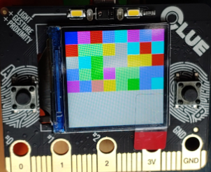
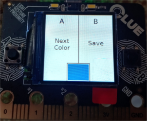

BLE Color Patchwork Demo
---
Required Libraries:
 - adafruit_ble
 - adafruit_clue
 
### Usage: 
The demo has two main modes, color selection mode, and patchwork viewing mode. 

### In patchwork viewing mode:

The grid of colored "patches" is drawn on the screen. Each one represents a nearby device advertising color data. The top left patch shows your own advertised color. 
 - Press `(A)` button to enter color selection mode
 - Press `(B)` button to scan for devices and refresh the patchwork on the screen

 
 
### In color selection mode: 

 - Press `(A)` button to advance to the next color
 - Press `(B)` button to save the selected color
